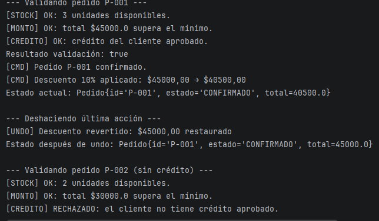
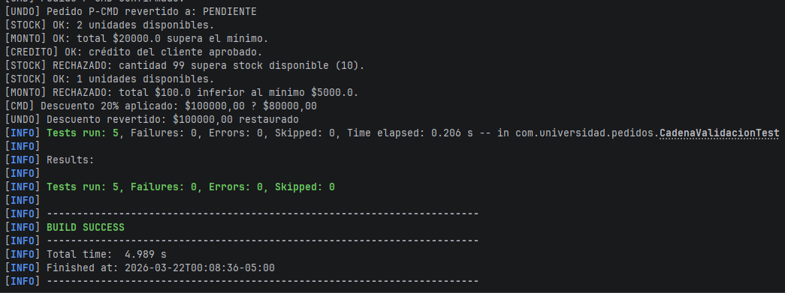

# pedidos-comportamiento

## Descripción

El sistema modela un flujo simple de comercio electrónico donde un pedido pasa por una cadena de validación antes de ser procesado.  
Si el pedido es válido, se ejecutan comandos como confirmar el pedido y aplicar descuentos, con la posibilidad de deshacer la última acción ejecutada.
## Estructura del proyecto

src/main/java/com/universidad/pedidos
PedidosApp.java
modelo
cor 
command

## Ejecucion del proyecto 
- Entrar a la carpeta del proyecto
- Compilar el proyecto: mvn clean package
- Ejecutar las pruebas: mvn test
- Ejecutar la aplicación
Si el proyecto compila correctamente, puedes ejecutarlo desde el IDE o con Maven: mvn spring-boot:run

## Capturas 

